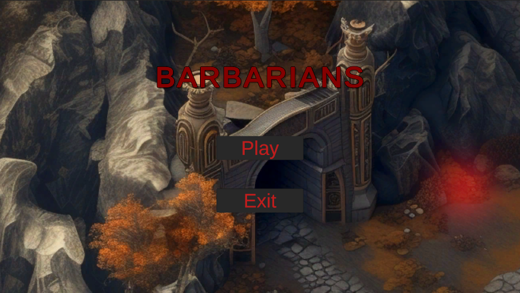
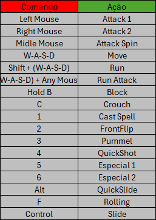

## 1. Overview

O projeto Unity chamado Barbarians surge no contexto de uma avaliação na matéria de Inteligencia Artifical da Universidade do Estado da Bahia. Neste jogo é possivel testar diferentes estados, mecanicas e habilidades do personagem Golem em um mapa simples.

## 2. Comandos

A lista acima representa os comandos que o jogador pode executar dentro do jogo e a resposta para cada um deles. Para além disso existem interações de estados específicos como o "morto" que ocorre quando o jogador interage com elementos do cenário, como o fogo.

## 3. Diagramas

A administração de estados foi realizada através do animator existente na Unity em conjunto ao new input system. Nesse modelo o jogador tem como estado inicial uma postura Idle que pode ser alternada dinamicamente através de comandos citados anteriormente neste documento. Todas as ligações das maquinas de estado podem ser vistos na imagem acima.
